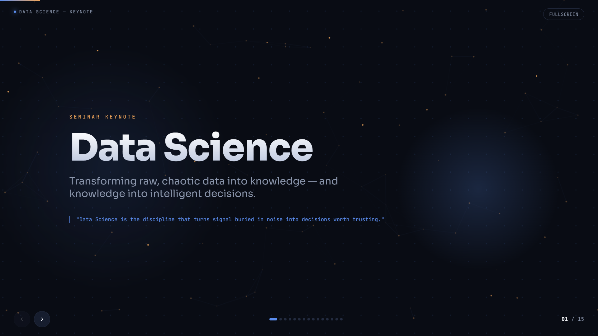
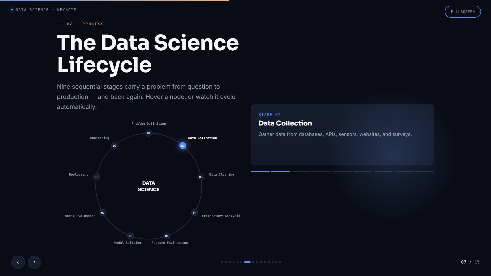

# GenAI Presentation — Prompt Engineering & Multi-Model Workflow


> 🎯 **[View Live Presentation →](https://lakshpreetkaur02.github.io/prompt-engineering-presentation/)**

A 15-slide Data Science keynote presentation created with Generative AI, demonstrating AI-assisted content development, visual design, iterative refinement, and multi-model workflow using ChatGPT and Claude.

## 🚀 Live Presentation

Interactive 15-slide Data Science presentation created using a multi-model Generative AI workflow.

## 🖼️ Presentation Preview

### Title Slide



### Content Slide


### Visual / Data Slide



## 📌 Project Overview

This project explores how Generative AI can be used as a creative and productivity tool to develop a complete professional presentation — from concept and narrative structure to content, visual direction, refinement, and final presentation.

The presentation focuses on **Data Science** and was developed as a seminar/keynote-style presentation with a consistent modern technical visual identity.

## 🎯 Objective

The goal was to create a professional 10–15 slide presentation while using Generative AI throughout the development process.

The workflow focused on:

- Developing the presentation concept and narrative
- Generating and refining presentation content
- Exploring visual and design directions with AI
- Iterating on ideas and presentation structure
- Using multiple AI models for different stages of development
- Producing a final interactive HTML presentation

## 🤖 Generative AI Workflow

The project used **ChatGPT and Claude** as AI-assisted development tools.

The workflow involved:

1. **Concept development**  
   Establishing the presentation topic, audience, narrative, and overall direction.

2. **Content development**  
   Using Generative AI to help develop and refine slide content.

3. **Visual direction**  
   Exploring modern presentation layouts, typography, color systems, visual hierarchy, and interactive elements.

4. **Iterative refinement**  
   Reviewing generated ideas, identifying improvements, and refining the presentation through multiple iterations.

5. **Final implementation**  
   Converting the developed concept into a self-contained interactive HTML presentation.

## 🧠 Prompt Engineering Approach

Rather than relying on a single prompt, the project used an iterative AI-assisted workflow.

The process involved progressively refining:

- Context
- Desired output
- Presentation structure
- Visual requirements
- Content quality
- Consistency
- User experience

This demonstrates how prompt engineering can be used as an **iterative problem-solving process**, rather than simply generating a one-time response.

## 🔄 AI-Assisted Workflow

```text
Presentation Concept
        ↓
AI-Assisted Ideation
        ↓
Content & Narrative Development
        ↓
Multi-Model Refinement
(ChatGPT + Claude)
        ↓
Visual & Structural Iteration
        ↓
Final Interactive HTML Presentation
        ↓
GitHub Pages Deployment

### AI Tools & Workflow

The presentation was developed using a multi-model Generative AI workflow:

- **ChatGPT** — used for ideation, presentation structure, content development, and iterative refinement.
- **Claude** — used as a complementary model for reviewing, refining, and improving the presentation.
- **Prompt engineering** — prompts were iteratively refined by providing context, objectives, constraints, visual direction, and feedback.
- **Human review** — AI-generated outputs were reviewed, selected, edited, and integrated into the final presentation.

The workflow demonstrates how multiple GenAI tools can be combined with human judgment to move from an initial concept to a polished final deliverable.

## 📈 Project Outcome

The final result is a 15-slide interactive Data Science keynote that combines AI-assisted content development with a custom visual presentation experience.

The project demonstrates the ability to take an idea from an initial concept through AI-assisted ideation, refinement, implementation, and deployment as a working web-based presentation.

## 🎨 Presentation

The final presentation contains **15 slides** covering Data Science concepts, applications, workflows, and real-world examples.

The visual design uses:

- Dark technical aesthetic
- Consistent typography
- Data-inspired visual elements
- Interactive navigation
- Charts and diagrams
- Structured information hierarchy
- Responsive presentation layout

## 💼 Skills Demonstrated

This project demonstrates practical experience with:

- Prompt engineering for structured creative and technical tasks
- Multi-model Generative AI workflows
- AI-assisted content generation and refinement
- Iterative evaluation and improvement of AI outputs
- Translating AI-generated ideas into a working interactive presentation
- Visual communication and presentation design
- Using AI as a collaborative tool rather than relying on a single generated output
- 
## 🛠️ Tools & Technologies

- **ChatGPT** — AI-assisted ideation, content development, and refinement
- **Claude** — AI-assisted development and refinement
- **Generative AI** — Content and visual exploration
- **HTML**
- **CSS**
- **JavaScript**
- **GitHub**
- **GitHub Pages**

## 📂 Project Structure

```text
prompt-engineering-presentation/
│
├── README.md
└── index.html

## 💡 Key Takeaways

This project reinforced several practical lessons about working with Generative AI:

- Better results come from clear context, constraints, and iterative refinement.
- Different AI models can be used as complementary tools within the same workflow.
- AI-generated content still requires human review, selection, and refinement.
- Prompt engineering is an iterative process rather than a one-shot instruction.
- Generative AI can support both creative direction and technical implementation.
- A successful AI workflow should produce a usable final deliverable, not just generated text.
