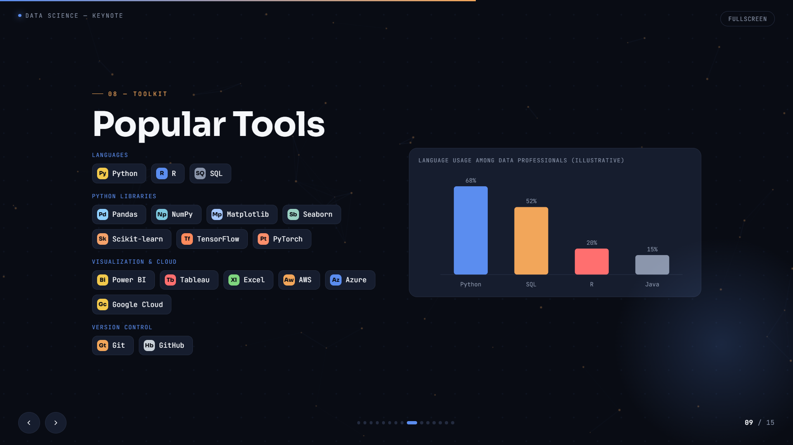

# GenAI Presentation — Prompt Engineering & Multi-Model Workflow

A 15-slide Data Science keynote presentation created with Generative AI, demonstrating AI-assisted content development, visual design, iterative refinement, and multi-model workflow using ChatGPT and Claude.

## 🚀 Live Presentation

**View the interactive presentation:**  
https://lakshpreetkaur02.github.io/prompt-engineering-presentation/

## 🖼️ Presentation Preview

### Title Slide


### Content Slide



### Visual / Data Slide


## 📌 Project Overview

This project explores how Generative AI can be used as a creative and productivity tool to develop a complete professional presentation — from concept and narrative structure to content, visual direction, refinement, and final presentation.

The presentation focuses on **Data Science** and was developed as a seminar/keynote-style presentation with a consistent modern technical visual identity.

## 🎯 Objective

The goal was to create a professional 10–15 slide presentation while using Generative AI throughout the development process.

The workflow focused on:

- Developing the presentation concept and narrative
- Generating and refining presentation content
- Exploring visual and design directions with AI
- Iterating on ideas and presentation structure
- Using multiple AI models for different stages of development
- Producing a final interactive HTML presentation

## 🤖 Generative AI Workflow

The project used **ChatGPT and Claude** as AI-assisted development tools.

The workflow involved:

1. **Concept development**  
   Establishing the presentation topic, audience, narrative, and overall direction.

2. **Content development**  
   Using Generative AI to help develop and refine slide content.

3. **Visual direction**  
   Exploring modern presentation layouts, typography, color systems, visual hierarchy, and interactive elements.

4. **Iterative refinement**  
   Reviewing generated ideas, identifying improvements, and refining the presentation through multiple iterations.

5. **Final implementation**  
   Converting the developed concept into a self-contained interactive HTML presentation.

## 🧠 Prompt Engineering Approach

Rather than relying on a single prompt, the project used an iterative AI-assisted workflow.

The process involved progressively refining:

- Context
- Desired output
- Presentation structure
- Visual requirements
- Content quality
- Consistency
- User experience

This demonstrates how prompt engineering can be used as an **iterative problem-solving process**, rather than simply generating a one-time response.

## 🎨 Presentation

The final presentation contains **15 slides** covering Data Science concepts, applications, workflows, and real-world examples.

The visual design uses:

- Dark technical aesthetic
- Consistent typography
- Data-inspired visual elements
- Interactive navigation
- Charts and diagrams
- Structured information hierarchy
- Responsive presentation layout

## 🛠️ Tools & Technologies

- **ChatGPT** — AI-assisted ideation, content development, and refinement
- **Claude** — AI-assisted development and refinement
- **Generative AI** — Content and visual exploration
- **HTML**
- **CSS**
- **JavaScript**
- **GitHub**
- **GitHub Pages**

## 📂 Project Structure

```text
prompt-engineering-presentation/
│
├── README.md
└── index.html
